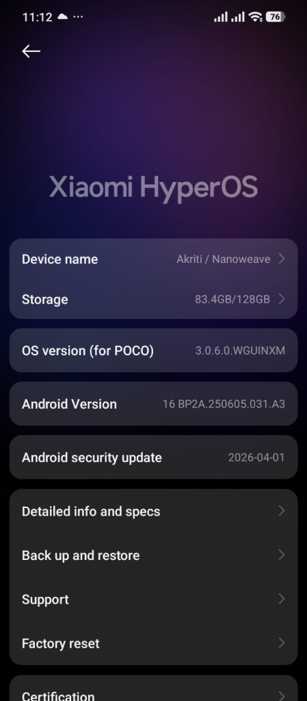
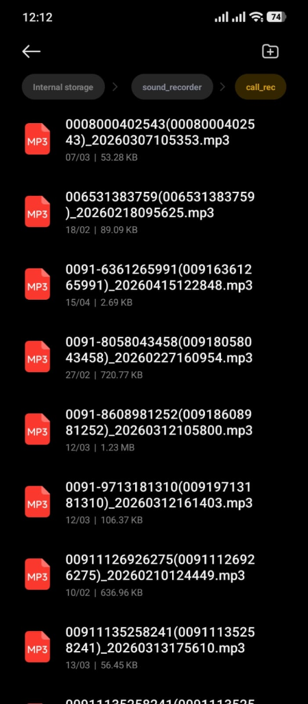

# SilentScribe 🎙️🛡️

[](#)
[](#)
[](#)
[](#)

**SilentScribe** is a premium, privacy-first Android application designed specifically to watch, decode, transcribe, and summarize call recordings locally on your device. Initially tailored for MIUI and Xiaomi HyperOS, it runs completely offline with **zero network footprint** to guarantee absolute data confidentiality.

---

## 📖 Table of Contents
- [Key Features](#-key-features)
- [How It Works](#-how-it-works)
- [Screen Walkthrough & Device Layout](#-screen-walkthrough--device-layout)
- [Architecture & Design System](#-architecture--design-system)
- [Getting Started](#-getting-started)
- [MIUI / HyperOS Optimization Guide](#-miui--hyperos-optimization-guide)
- [Privacy Guarantee](#-privacy-guarantee)

---

## ✨ Key Features

- **100% Offline Speech-to-Text**: Powered by **Sherpa-ONNX Whisper ASR** for highly accurate local transcriptions.
- **Zero Internet Permission**: The app explicitly removes the `INTERNET` permission in its merged manifest and blocks all cleartext traffic via Network Security Configs.
- **Native Audio Decoding Pipeline**: Extracts audio metadata, downmixes stereo to mono, and resamples any input format (MP3, M4A, WAV, etc.) to 16kHz PCM WAV using native `MediaCodec` and `MediaExtractor` APIs.
- **Background Watcher Service**: Automatically scans for new recordings in your configured directory using Android's `FileObserver` with a 2-second debounce verification step.
- **Intelligent Resource Optimization**: Dynamically pauses transcription work when the screen is active (unlocked) to preserve device performance, and resumes processing automatically when the screen is locked.
- **Local LLM Summarization**: Powered by **MediaPipe Tasks GenAI**, extracting sentiment, bulleted call highlights, and action items locally via an on-device LLM model.
- **Modern Jetpack Compose UI**: Features a sleek, custom dark/slate design system with setup wizards, full search index, and tabbed Call Details view.

---

## 🔄 How It Works

```mermaid
graph TD
    A[MIUI Call Recorder writes audio file] --> B[FileObserver detects new file]
    B --> C[2s File Stability Debounce]
    C --> D[Background Worker queue]
    D --> E{Screen State Check}
    E -- Active --> F[Pause processing to save resources]
    E -- Locked --> G[Resample & Downmix to 16kHz PCM WAV]
    G --> H[Whisper ASR (Sherpa-ONNX) transcribes voice to text]
    H --> I[Local LLM (MediaPipe) summarizes text]
    I --> J[Write record to Room Database]
    J --> K[Delete temporary WAV files in try-finally]
```

---

## 📱 Screen Walkthrough & Device Layout

### 1. Xiaomi HyperOS Target Device Setup
The setup wizard guides you through the necessary background exemptions, notifying you of active monitoring states.



### 2. Call Recorder Directory Structure
SilentScribe automatically maps incoming recording formats to parse contacts, numbers, and call times.



---

## 🛠️ Architecture & Design System

### Technology Stack
*   **UI Framework**: Jetpack Compose with Material 3 styling.
*   **Navigation**: Type-safe Jetpack Navigation using Kotlin Serialization.
*   **Database**: Room DB with KSP compiler for fast query responses.
*   **Speech Recognition**: Sherpa-ONNX (Whisper ASR).
*   **Local LLM**: MediaPipe Tasks GenAI SDK.
*   **Target SDK**: Compile & Target SDK `35` / `36` (Android 15+).

### Package Layout
```
com.example.mobileaudiowhatsapp/
├── data/                  # Room Entity, DAO, and Repository
├── ml/                    # SpeechToTextManager (ASR) and SummarisationManager (LLM)
├── receiver/              # BootCompletedReceiver (startup persistence)
├── service/               # CallFolderWatcherService (background watcher)
├── theme/                 # Slate-Dark palette colors, typography, shapes
└── ui/                    # Dashboard, History, Call Details, and Settings Screens
```

---

## 🚀 Getting Started

### Prerequisites
- JDK 17 (Recommended: Eclipse Adoptium JDK 17)
- Android SDK & Build Tools

### Build Instructions
1. Clone the repository:
   ```bash
   git clone https://github.com/topcatai/SilentScribe.git
   cd SilentScribe
   ```
2. Build the Debug APK:
   ```bash
   ./gradlew clean assembleDebug
   ```
   The compiled APK will be output to: `app/build/outputs/apk/debug/app-debug.apk`

3. Run unit tests:
   ```bash
   ./gradlew test
   ```

---

## ⚙️ MIUI / HyperOS Optimization Guide

To prevent Android's strict battery saver policies from killing the background monitoring service:

1. **Auto-Start**: Go to `Settings -> Apps -> Manage Apps -> SilentScribe` and toggle **Autostart** to **ON**.
2. **Battery Saver**: Set battery restrictions to **No Restrictions**.
3. **Storage Access**: Accept the **All Files Access** (`MANAGE_EXTERNAL_STORAGE`) prompt to permit scanning inside public call directories.

---

## 🔒 Privacy Guarantee

> [!IMPORTANT]
> SilentScribe operates under strict network isolation. There is absolutely NO telemetry, NO cloud synchronization, and NO internet permission declared in the manifest. All audio decoding, transcriptions, and database storage remain entirely on your local hardware.
